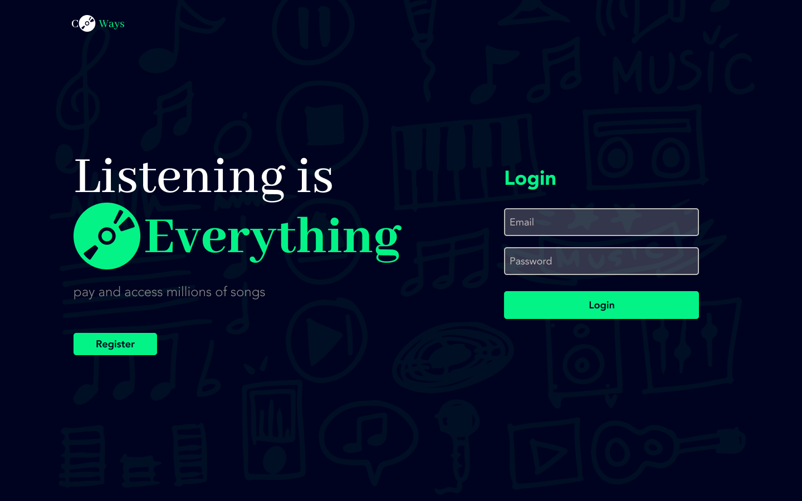
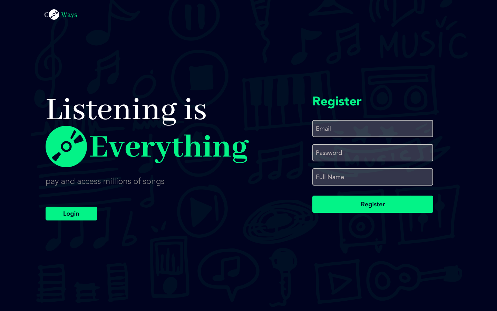
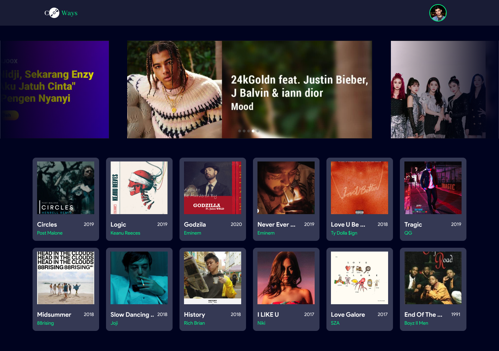
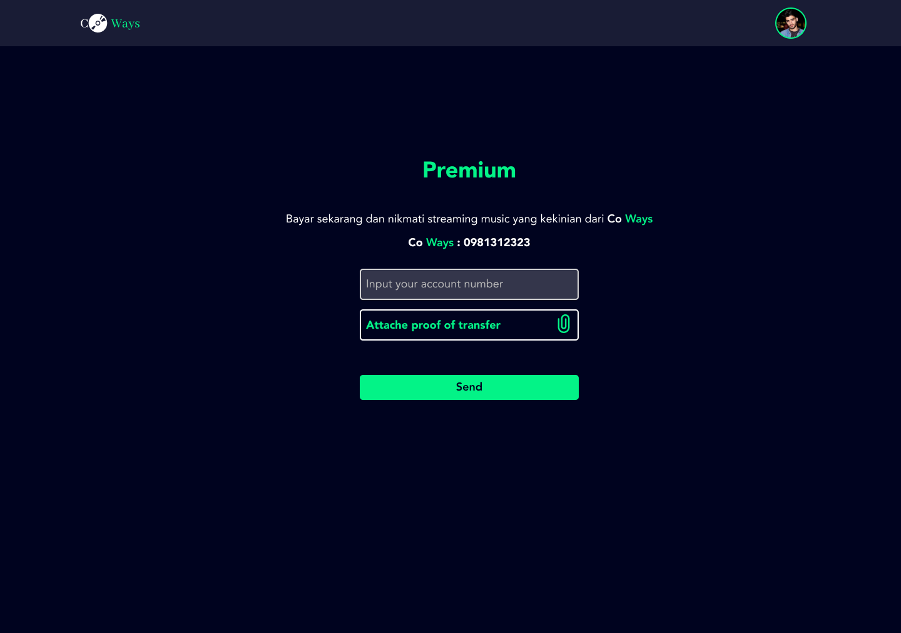
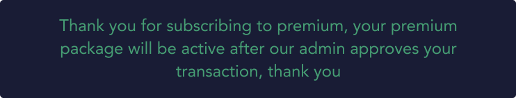
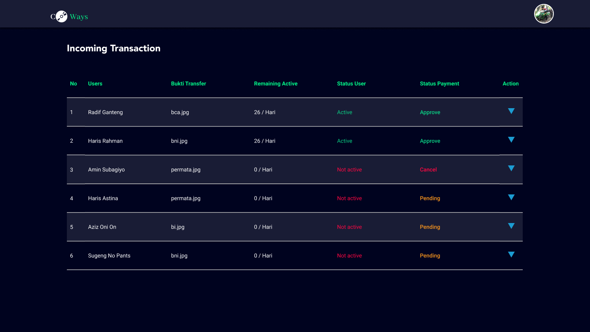
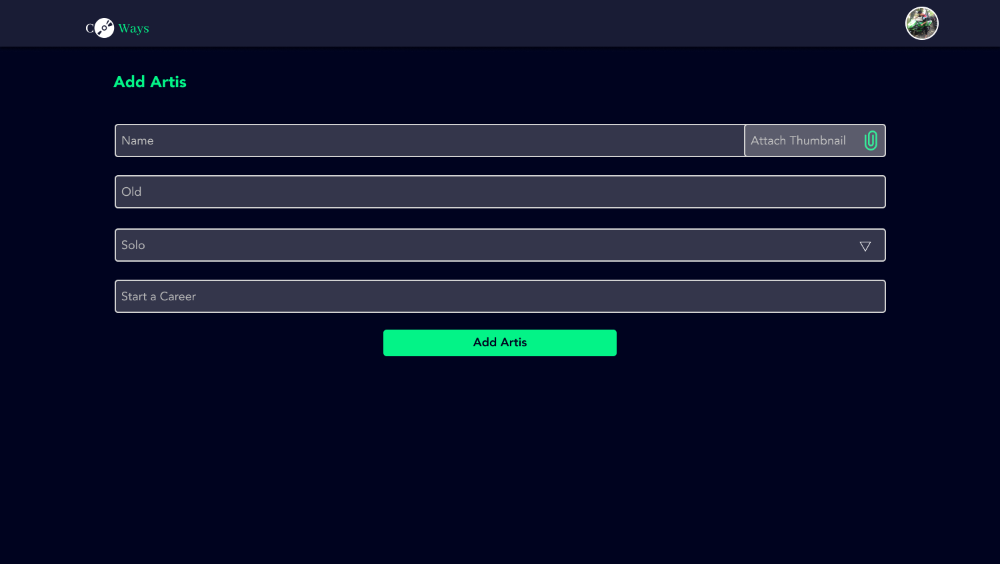
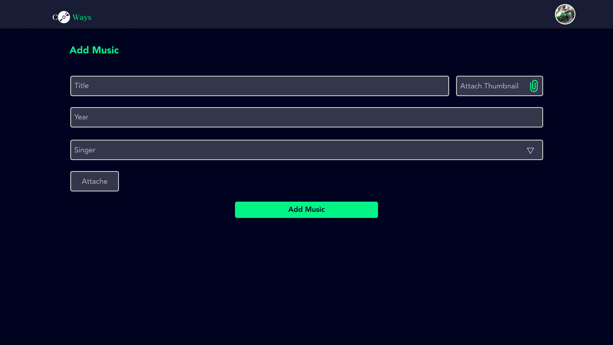
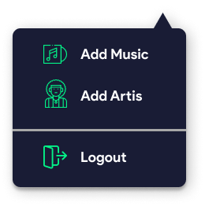
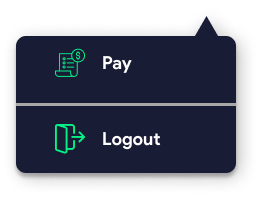

> `1. Login`



# LOGIN

## A. Requirements

- Make a display like the following, if possible better than following mockup
- There are email input field (text type)
- There are password input field (password type)
- For now you can use localStorage to save data user

## B. Instructions

- When you finish this task, move it to "test" list. Then don't forget to push your job on https://github.com/[your_name]_coWays_fe
- Create branch `1.Login`.

  ```
  git checkout -b 1. Login
  ```

- Push to branch `1. Login `.

  ```
  git add .
  git commit -m "add login"
  git push origin 1. Login
  ```

Link mockup [Here](https://www.figma.com/file/J2Sg6EI5DY7tL4gWqvQ94R/CoWays?node-id=0%3A1)

==========================================================================

> `2. Register`



# REGISTER

## A. Requirements

- Make a display like the following, if possible better than following mockup
- There are email input field (text type)
- There are password input field (password type)
- There are full name input field (text type)
- For now you can use localStorage to save data user

## B. Instructions

- When you finish this task, move it to "test" list. Then don't forget to push your job on https://github.com/[your_name]_coWays_fe
- Create branch `2.Register`.

```
   git checkout -b 2. Register
```

- Push to branch `2. Register `.

```
   git add .
   git commit -m "add register"
   git push origin 2. Register
```

==========================================================================

> `3. Homepage`




# HOMEPAGE

## A. Requirements

- Music is taken from the database or dummy on your local
- Use the seeder for music data
- There are 1 avatar in the header
- if the user clicks on the music not payment will bring up the pay capital
- if the user clicks on music but is payment it will bring up the player

## B. Instructions

- When you finish this task, move it to "test" list. Then don't forget to push your job on https://github.com/[your_name]_coWays_fe
- Create branch `3.Home`.

```
   git checkout -b 3. Home
```

- Push to branch `3. Home `.

```
   git add .
   git commit -m "add home"
   git push origin 3. Home
```

==========================================================================

> `4. Payment`





# PAYMENT

## A. Requirements

- provide 1 text input account number (No.Rek)
- 1 button or something to upload/attach proof of transfer
- 1 button to send your account data and proof of your transfer to the movie can only be watched if the status is active
- Calculation of the grace period when sending transactions + 1 month

## B. Instructions

- When you finish this task, move it to "test" list. Then don't forget to push your job on https://github.com/[your_name]_coWays_fe
- Create branch `4.Payment`.

```
   git checkout -b 4. Payment
```

- Push to branch `4. Payment `.

```
   git add .
   git commit -m "add payment"
   git push origin 4. Payment
```

==========================================================================

> `5. Player`


# PLAYER

## A. Requirements

- provide 1 text input account number (No.Rek)
- 1 button or something to upload/attach proof of transfer
- 1 button to send your account data and proof of your transfer to the movie can only be watched if the status is active
- Calculation of the grace period when sending transactions + 1 month

## B. Instructions

- When you finish this task, move it to "test" list. Then don't forget to push your job on https://github.com/[your_name]_coWays_fe
- Create branch `5.Player`.

```
   git checkout -b 5. Player
```

- Push to branch `5. Player `.

```
   git add .
   git commit -m "add player"
   git push origin 5. Player
```

==========================================================================

> `6. List Transaction`



# LIST TRANSACTION

## A. Requirements

- UI UX
- Make a form like in mockup
- Data is taken from the database
- on actions Every dropdown transaction approves the transaction or cancels the transaction

## B. Instructions

- When you finish this task, move it to "test" list. Then don't forget to push your job on https://github.com/[your_name]_coWays_fe
- Create branch `6.List Transaction`.

```
   git checkout -b 6. List Transaction
```

- Push to branch `6. List Transaction `.

```
   git add .
   git commit -m "add List Transaction"
   git push origin 6. List Transaction
```

==========================================================================

> `7. Add Artist`



# ADD ARTIST

## A. Requirements

- UI UX
- Make a form like in mockup
- Image, Name, Old, Start Career
- Type Combobox

## B. Instructions

- When you finish this task, move it to "test" list. Then don't forget to push your job on https://github.com/[your_name]_coWays_fe
- Create branch `7.Add Artist`.

```
   git checkout -b 7. Add Artist
```

- Push to branch `7. Add Artist `.

```
   git add .
   git commit -m "add Add Artist"
   git push origin 7. Add Artist
```

==========================================================================

> `8. Add Music`



# ADD MUSIC

## A. Requirements

- UI UX
- Make a form like in mockup
- Title, Year
- Attache Thumbnail type file
- Attache music type file
- Singer Combobox Data is taken from the database

## B. Instructions

- When you finish this task, move it to "test" list. Then don't forget to push your job on https://github.com/[your_name]_coWays_fe
- Create branch `8.Add Music`.

```
   git checkout -b 8. Add Music
```

- Push to branch `8. Add Music `.

```
   git add .
   git commit -m "add Add Music"
   git push origin 8. Add Music
```

==========================================================================

> `9. Dropdown`





# DROPDOWN

## A. Requirements

- UI UX
- Make a form like in mockup
- Dropdown for member, will appear if click the avatar in header
- Dropdown for admin, will appear if click the avatar in header
- Dropdown transaction, will appear if click the icon in every transaction can be Approve and Cancel the transction

## B. Instructions

- When you finish this task, move it to "test" list. Then don't forget to push your job on https://github.com/[your_name]_coWays_fe
- Create branch `9.Dropdown`.

```
   git checkout -b 9. Dropdown
```

- Push to branch `9. Dropdown `.

```
   git add .
   git commit -m "add Dropdown"
   git push origin 9. Dropdown
```

==========================================================================
